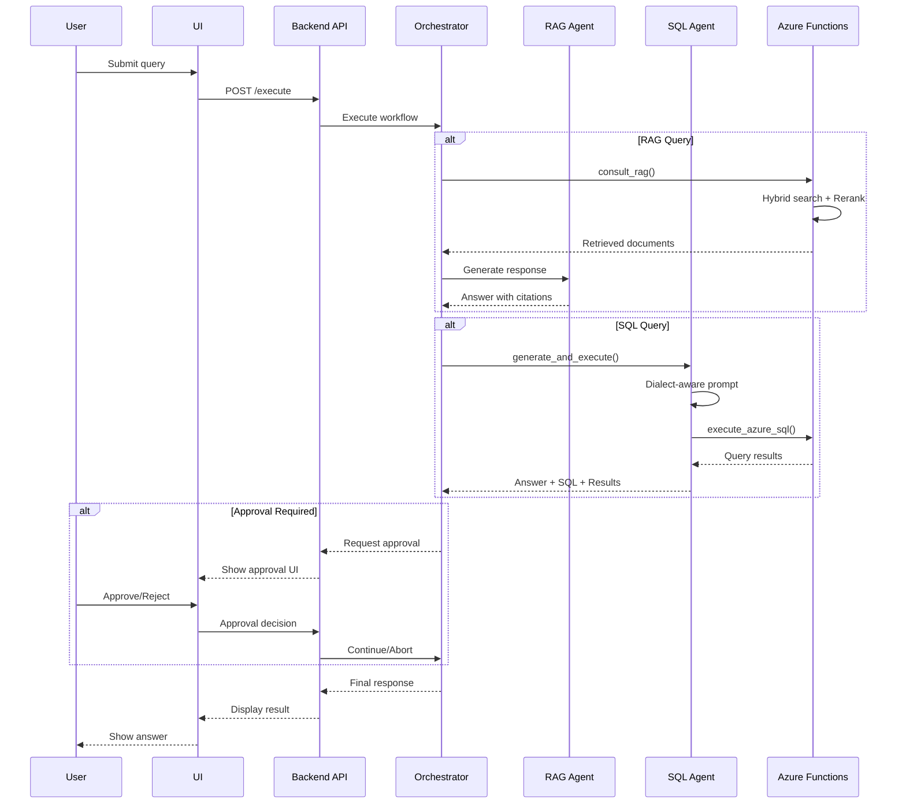

# Architecture Overview

## System Design

```
┌─────────────────────────────────────────────────────────────────────────────────┐
│                                   Frontend                                       │
│                          (Next.js / React - Port 3000)                          │
│  ┌──────────────┐  ┌──────────────┐  ┌──────────────┐  ┌──────────────────────┐ │
│  │   Builder    │  │   Execute    │  │    Chat      │  │   File Explorer      │ │
│  │   (Persona,  │  │   Monitor    │  │   Interface  │  │   (Upload, Browse)   │ │
│  │   Workflows) │  │              │  │              │  │                      │ │
│  └──────────────┘  └──────────────┘  └──────────────┘  └──────────────────────┘ │
└─────────────────────────────────────────────────────────────────────────────────┘
                                        │
                                        ▼ HTTP/REST
┌─────────────────────────────────────────────────────────────────────────────────┐
│                              Backend API                                         │
│                         (FastAPI - Port 8000)                                   │
│  ┌──────────────────────────────────────────────────────────────────────────┐   │
│  │                        Azure Executor                                     │   │
│  │   • Workflow orchestration                                               │   │
│  │   • Agent coordination                                                   │   │
│  │   • Human-in-the-loop approval                                           │   │
│  └──────────────────────────────────────────────────────────────────────────┘   │
│                                        │                                         │
│  ┌─────────────────┐  ┌────────────────┼──────────────┐  ┌─────────────────┐   │
│  │   SQL Agent     │  │                ▼              │  │   RAG Agent     │   │
│  │   (Dialect-     │  │    ┌──────────────────────┐   │  │   (HyDE,        │   │
│  │    aware)       │  │    │  Azure Functions     │   │  │    Rerank)      │   │
│  └─────────────────┘  │    │  (Serverless)        │   │  └─────────────────┘   │
│           │           │    └──────────────────────┘   │           │             │
└───────────┼───────────┴──────────────────────────────┴───────────┼─────────────┘
            │                          │                            │
            ▼                          ▼                            ▼
┌─────────────────┐     ┌─────────────────────────┐     ┌─────────────────────┐
│  Local DBs      │     │   Azure Functions        │     │   Azure AI Search   │
│  • SQLite       │     │   • index_document       │     │   • Vector index    │
│  • DuckDB       │     │   • consult_rag          │     │   • Semantic config │
│                 │     │   • execute_azure_sql    │     │   • Hybrid retrieval│
└─────────────────┘     └─────────────────────────┘     └─────────────────────┘
                                   │
            ┌──────────────────────┼──────────────────────┐
            ▼                      ▼                      ▼
┌─────────────────┐     ┌─────────────────┐     ┌─────────────────┐
│  Azure OpenAI   │     │  Azure SQL      │     │  Azure Storage  │
│  • GPT-4o       │     │  Server         │     │  • Documents    │
│  • Embeddings   │     │  • PostgreSQL   │     │  • Cache        │
└─────────────────┘     └─────────────────┘     └─────────────────┘
```

---

## Agent Flow



---

## Package Structure

### Core Package (`agent_framework`)

```python
# Key modules
from agent_framework.agents.sql import SQLAgent, SQLPromptBuilder, get_dialect_instructions
from agent_framework.data.connectors import SQLiteConnector, DuckDBConnector, PostgresConnector
from agent_framework.tools.local_sql_tools import LocalSQLTools
```

### Azure Package (`agent_framework_azure_ai`)

```python
# Azure-specific connectors
from agent_framework_azure_ai.connectors import AzureSQLConnector
from agent_framework_azure_ai.azure_foundry_agent_adapter import AzureFoundryAgentAdapter
```

---

## SQL Agent Design

```
┌─────────────────────────────────────────────────────────────────────────────────┐
│                              SQL Agent Pipeline                                  │
├─────────────────────────────────────────────────────────────────────────────────┤
│                                                                                  │
│  ┌─────────────┐    ┌─────────────────┐    ┌─────────────────┐                  │
│  │ User Query  │───▶│ Dialect         │───▶│ Schema +        │                  │
│  │             │    │ Detection       │    │ RAG Context     │                  │
│  └─────────────┘    └─────────────────┘    └─────────────────┘                  │
│                            │                        │                            │
│                            ▼                        ▼                            │
│  ┌─────────────────────────────────────────────────────────────────┐            │
│  │                    SQLPromptBuilder                              │            │
│  │  • Base prompt with schema                                       │            │
│  │  • Dialect-specific instructions (DuckDB/PostgreSQL/SQLite/MSSQL)│            │
│  │  • Few-shot examples                                             │            │
│  │  • Feedback from previous attempts                               │            │
│  └─────────────────────────────────────────────────────────────────┘            │
│                            │                                                     │
│                            ▼                                                     │
│  ┌─────────────────────────────────────────────────────────────────┐            │
│  │                    LLM Generation                                │            │
│  │  Generate SQL query with dialect awareness                       │            │
│  └─────────────────────────────────────────────────────────────────┘            │
│                            │                                                     │
│                            ▼                                                     │
│  ┌─────────────────────────────────────────────────────────────────┐            │
│  │                    Execute + Retry Loop                          │            │
│  │  • Execute SQL via connector                                     │            │
│  │  • On error: Add feedback, retry (max 3)                         │            │
│  │  • Aggregation detection → Fetch raw records                     │            │
│  └─────────────────────────────────────────────────────────────────┘            │
│                            │                                                     │
│                            ▼                                                     │
│  ┌─────────────────────────────────────────────────────────────────┐            │
│  │                    Response                                      │            │
│  │  { sql, results, raw_results, attempts, dialect }                │            │
│  └─────────────────────────────────────────────────────────────────┘            │
│                                                                                  │
└─────────────────────────────────────────────────────────────────────────────────┘
```

---

## RAG Pipeline Design

```
┌─────────────────────────────────────────────────────────────────────────────────┐
│                              RAG Pipeline                                        │
├─────────────────────────────────────────────────────────────────────────────────┤
│                                                                                  │
│  ┌─────────────┐    ┌─────────────────┐    ┌─────────────────┐                  │
│  │ User Query  │───▶│ Query Expansion │───▶│ HyDE Generation │                  │
│  │             │    │ (Multi-query)   │    │ (Hypothetical   │                  │
│  │             │    │                 │    │  Document)      │                  │
│  └─────────────┘    └─────────────────┘    └─────────────────┘                  │
│                            │                        │                            │
│                            ▼                        ▼                            │
│  ┌─────────────────────────────────────────────────────────────────┐            │
│  │                    Hybrid Search                                 │            │
│  │  • Vector search (embedding similarity)                          │            │
│  │  • BM25 keyword search                                           │            │
│  │  • Semantic ranking (Azure AI Search)                            │            │
│  └─────────────────────────────────────────────────────────────────┘            │
│                            │                                                     │
│                            ▼                                                     │
│  ┌─────────────────────────────────────────────────────────────────┐            │
│  │                    Reranking                                     │            │
│  │  • Cross-encoder reranking                                       │            │
│  │  • Score normalization                                           │            │
│  │  • Deduplication                                                 │            │
│  └─────────────────────────────────────────────────────────────────┘            │
│                            │                                                     │
│                            ▼                                                     │
│  ┌─────────────────────────────────────────────────────────────────┐            │
│  │                    Response Generation                           │            │
│  │  • Context assembly                                              │            │
│  │  • LLM synthesis                                                 │            │
│  │  • Citation extraction                                           │            │
│  └─────────────────────────────────────────────────────────────────┘            │
│                                                                                  │
└─────────────────────────────────────────────────────────────────────────────────┘
```

---

## Data Flow

| Source | Processing | Storage | Retrieval |
|--------|------------|---------|-----------|
| PDF/DOCX | Doc Intelligence → Chunking | Azure AI Search | Hybrid + Rerank |
| CSV/Excel | Schema extraction | DuckDB/SQLite | SQL Query |
| Azure SQL | Connection string | Azure SQL DB | SQL Query |
| User docs | Embedding | Vector index | Semantic search |

---

## Extension Points

### Adding a New Database Dialect

```python
# 1. Update get_dialect_instructions() in sql.py
if "mysql" in dialect:
    return """
**MySQL Syntax:**
- Use DATE_ADD/DATE_SUB for date math
- Use LIMIT for row limits
"""

# 2. Create connector with dialect property
class MySQLConnector(SQLConnector):
    @property
    def dialect(self) -> str:
        return "mysql"
```

### Adding a New Agent

```python
from agent_framework._agents import BaseAgent

class CustomAgent(BaseAgent):
    async def run(self, messages, **kwargs):
        # Agent logic
        return AgentRunResponse(messages=[...])
```

### Adding a New Azure Function

```python
# azure-functions/my_function/__init__.py
import azure.functions as func

async def main(req: func.HttpRequest) -> func.HttpResponse:
    # Function logic
    return func.HttpResponse(json.dumps(result))
```
