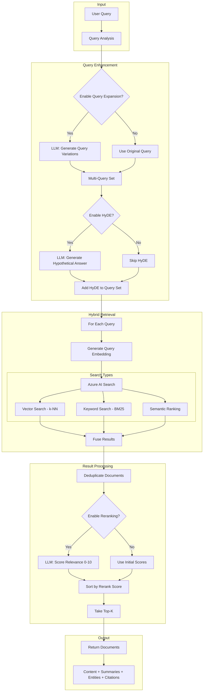
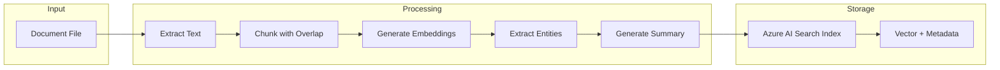

# RAG Agent Architecture

## Overview

The RAG (Retrieval-Augmented Generation) Agent provides semantic document search with advanced retrieval techniques including query expansion, HyDE (Hypothetical Document Embedding), hybrid search, and LLM-based reranking.

---

## Pipeline Flow Diagram



---

## Document Types Supported

| Format | Extension | Processing | Notes |
|--------|-----------|------------|-------|
| **PDF** | `.pdf` | pypdf/PyPDF2 | Page-level extraction |
| **Text** | `.txt` | Direct read | UTF-8 encoding |
| **Markdown** | `.md` | Direct read | Preserves structure |
| **CSV** | `.csv` | Direct read | Row-based chunks |
| **Word** | `.docx` | Azure Doc Intelligence | Optional |

---

## RAG Pipelines

### 1. Standard Pipeline (`consult_rag_tool`)

Basic hybrid search with semantic ranking.

```
Query → Embed → Hybrid Search → Semantic Rank → Return Documents
```

| Feature | Status |
|---------|--------|
| Vector Search | ✅ |
| Keyword (BM25) | ✅ |
| Semantic Ranking | ✅ |
| Semantic Captions | ✅ |
| Query Expansion | ❌ |
| Reranking | ❌ |

### 2. Rerank Pipeline (`consult_rag_with_rerank`)

Standard + LLM reranking for precision.

```
Query → Hybrid Search → LLM Rerank → Return Top-K
```

| Feature | Status |
|---------|--------|
| All Standard Features | ✅ |
| LLM Reranking | ✅ |
| 3x Over-retrieval | ✅ |

### 3. Advanced Pipeline (`advanced_rag_retrieve`)

Full industry-standard RAG with all enhancements.

```
Query → Expand → HyDE → Multi-Query Retrieval → Fusion → Rerank → Return
```

| Feature | Status |
|---------|--------|
| Query Expansion | ✅ |
| HyDE | ✅ |
| Multi-Query Retrieval | ✅ |
| Result Fusion | ✅ |
| LLM Reranking | ✅ |

### 4. Facet Pipeline (`get_entity_facets`)

Aggregation queries without document retrieval.

```
Query → Facet Aggregation → Return Unique Values + Counts
```

Use for: "How many unique DTC codes?", "List all product names"

---

## Core Components

### 1. Query Expansion

Generates alternative query phrasings to improve recall:

```python
Original: "TCU temperature error"
Expanded: [
    "TCU temperature error",
    "transmission control unit thermal fault",
    "TCU overheating issue diagnostic"
]
```

### 2. HyDE (Hypothetical Document Embedding)

Generates a hypothetical answer to bridge vocabulary gap:

```python
Query: "What causes DTC P0700?"

HyDE Output:
"DTC P0700 indicates a transmission control system malfunction.
This code is set when the TCM detects an internal fault..."

# The HyDE text is embedded and used for semantic search
```

### 3. Hybrid Search

Combines three search strategies:

| Strategy | What it Captures | Strengths |
|----------|------------------|-----------|
| **Vector** | Semantic similarity | Synonyms, concepts |
| **Keyword** | Exact matches | Codes, IDs, names |
| **Semantic** | Azure AI ranking | Passage relevance |

### 4. LLM Reranking

Post-retrieval relevance scoring:

```
Input: Query + 20 candidate documents
LLM scores each 0-10 for relevance
Output: Top-K sorted by rerank score

Scoring criteria:
- Direct relevance to query
- Completeness of information
- Specificity to question asked
```

### 5. Semantic Chunking

Splits documents at natural boundaries:

```
┌──────────────────────────────────────────────┐
│         Fixed-Size Chunking                  │
│  "The car..." | "...drove. The" | " engine..." │
│        ↑ Breaks mid-sentence                 │
├──────────────────────────────────────────────┤
│         Semantic Chunking                    │
│  "The car drove to the store."               │
│  "The engine started smoothly."              │
│        ↑ Breaks at semantic boundaries       │
└──────────────────────────────────────────────┘
```

---

## Document Indexing Flow



### Index Schema

| Field | Type | Description |
|-------|------|-------------|
| `id` | String | Unique chunk ID |
| `workflow_id` | String | Workflow filter |
| `content` | String | Chunk text |
| `content_vector` | Vector | Embedding (1536-dim) |
| `title` | String | Document title |
| `source` | String | File path |
| `page_number` | Int | PDF page |
| `chunk_summary` | String | LLM-generated summary |
| `entities` | JSON | Extracted entities |
| `entity_codes` | Collection | Facetable entity list |

---

## Execution Routing

```
┌──────────────────────────────────────────────────────────────┐
│                    RAG Request Router                         │
├──────────────────────────────────────────────────────────────┤
│                                                               │
│  pipeline = "advanced" (default)                              │
│      ↓                                                        │
│  Is Azure Functions available?                                │
│      ├── YES → Call consult_rag Azure Function                │
│      └── NO  → Local RAGRetrievalAgent (InMemoryVectorStore)  │
│                                                               │
└──────────────────────────────────────────────────────────────┘
```

---

## Response Structure

```json
{
  "success": true,
  "documents": [
    {
      "id": "doc-123",
      "title": "TCU Diagnostics Manual",
      "content": "The P0700 code indicates...",
      "doc_type": "chunk",
      "score": 0.92,
      "reranker_score": 0.95,
      "rerank_score": 8,
      "metadata": {
        "source": "manual.pdf",
        "page": 45,
        "chunk_id": "3"
      },
      "summary": "Explains TCU diagnostic codes",
      "entities": ["TCU", "P0700", "CAN bus"],
      "captions": [{"text": "...", "highlights": "..."}]
    }
  ],
  "count": 10,
  "queries_used": ["original", "expanded1", "hyde"],
  "reranked": true,
  "hyde_used": true,
  "pipeline": "advanced",
  "semantic_answers": [
    {"text": "The P0700 code...", "score": 0.89}
  ]
}
```

---

## Configuration

| Parameter | Default | Description |
|-----------|---------|-------------|
| `top_k` | 100 | Results to return |
| `search_type` | "hybrid" | vector/keyword/hybrid/semantic |
| `pipeline` | "advanced" | standard/rerank/advanced/facets |
| `enable_rerank` | true | LLM reranking |
| `enable_query_expansion` | true | Generate query variations |
| `enable_hyde` | true | Hypothetical document |
| `threshold` | 0.5 | Semantic chunking threshold |
| `chunk_size` | 800 | Tokens per chunk |
| `overlap` | 200 | Overlap between chunks |

---

## Integration with SQL Agent

RAG provides schema enrichment for SQL queries:

```python
# SQL Agent calls RAG for column context
rag_result = await consult_rag(
    query=f"database column meanings: {table_names}",
    pipeline="advanced",
    workflow_id=workflow_id,
    top_k=5
)

# Combine with raw schema
enriched_schema = f"""
{raw_schema}

## Context from Documentation
{rag_result['documents']}
"""
```

This enables:
- Column descriptions not in raw schema
- Business rules and constraints
- Domain-specific terminology
- Historical query patterns

---

## Azure Functions

| Function | Purpose |
|----------|---------|
| `consult_rag` | Main RAG retrieval endpoint |
| `index_document` | Index new documents |
| `get_document_summary` | Get/generate doc summary |
| `extract_citations` | Extract source citations |
| `graph_query` | Query entity graph |

---

## Performance Considerations

| Technique | Latency Impact | Recall Impact | Precision Impact |
|-----------|----------------|---------------|------------------|
| Vector Only | Low | Medium | Medium |
| Hybrid | Medium | High | Medium |
| + Query Expansion | +200ms | +20% | Neutral |
| + HyDE | +300ms | +15% | +10% |
| + Reranking | +500ms | Neutral | +25% |
| Full Advanced | +1s | +35% | +35% |
