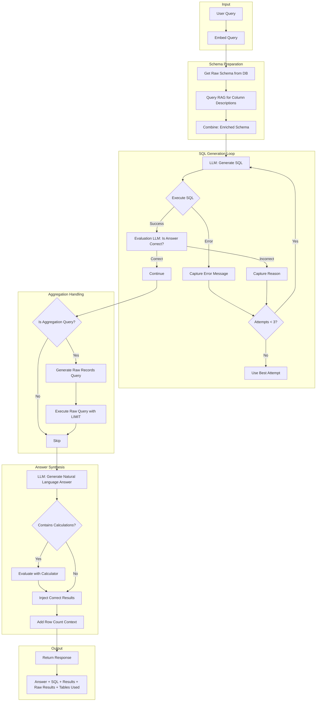

# SQL Agent Architecture

## Overview

The SQL Agent provides intelligent natural language to SQL query generation with automatic retry, correctness evaluation, and answer synthesis. It supports multiple database dialects and leverages RAG for schema enrichment.

---

## Query Flow Diagram



---

## Core Components

### 1. Schema Enrichment via RAG

Raw database schema lacks business context. We enrich it with documentation:

```
┌─────────────────────────────────────────────────────────────┐
│ Enriched Schema                                             │
├─────────────────────────────────────────────────────────────┤
│ ## Raw Schema                                               │
│ Table: orders                                               │
│   id INT PRIMARY KEY                                        │
│   customer_id INT                                           │
│   total_amount DECIMAL(10,2)                                │
│   created_at TIMESTAMP                                      │
│                                                             │
│ ## Context from RAG                                         │
│ - customer_id: References customers table, NULL for guests  │
│ - total_amount: Excludes tax and shipping                   │
│ - created_at: UTC timezone, indexed for date queries        │
└─────────────────────────────────────────────────────────────┘
```

### 2. Dialect-Aware Generation

Different databases require different SQL syntax:

| Dialect | Date Math | Date Trunc | Notes |
|---------|-----------|------------|-------|
| **DuckDB** | `INTERVAL 2 MONTH` | `date_trunc('month', col)` | Avoid DATEADD |
| **PostgreSQL** | `INTERVAL '2 months'` | `date_trunc('month', col)` | Standard SQL |
| **SQLite** | `datetime('now', '-2 months')` | `strftime('%Y-%m', col)` | Limited functions |
| **SQL Server** | `DATEADD(month, -2, GETDATE())` | `DATETRUNC(month, col)` | T-SQL |

### 3. Retry Loop with Feedback

Each failed attempt adds context for the next:

```
Attempt 1: SELECT AVG(price) FROM products
           Error: column "price" does not exist
           
Attempt 2: SELECT AVG(unit_price) FROM products
           Result: 45.67
           Evaluation: Incorrect - user asked for "average order value"
           
Attempt 3: SELECT AVG(total_amount) FROM orders
           Result: 156.23
           Evaluation: Correct ✓
```

### 4. Evaluation LLM

Verifies SQL results actually answer the question:

```
Input:
  Question: "What's our highest revenue month?"
  SQL: SELECT month, SUM(revenue) FROM sales GROUP BY month
  Result: [{month: "2024-03", sum: 50000}, {month: "2024-01", sum: 45000}]

Output:
  Correct: false
  Reason: "Query returns all months but doesn't identify which is highest. 
           Add ORDER BY and LIMIT 1."
```

### 5. Aggregation Detection

When SQL contains `AVG`, `SUM`, `COUNT`, `GROUP BY`, etc., we also fetch raw records:

```
Original Query: "What's the average order value per customer?"
Aggregation SQL: SELECT customer_id, AVG(total) FROM orders GROUP BY customer_id

→ Detected aggregation, generating raw records query...

Raw SQL: SELECT customer_id, total, created_at FROM orders LIMIT 200
```

### 6. Calculator Fallback

LLMs struggle with arithmetic. We intercept and compute:

```
LLM Answer: "The total is 1234.56 + 789.01 = 2023.57"
                                              ↑ Wrong!

Calculator: 1234.56 + 789.01 = 2023.57 → Actually correct here
            But: 45.6 + 12.3 + 78.9 = 136.8 (LLM said 136.7)
            
Fixed Answer: "The total is 136.8"
```

---

## Database Support Matrix

| Database | Local Execution | Azure Execution | Driver |
|----------|-----------------|-----------------|--------|
| SQLite (.db) | ✅ Python | ❌ N/A | sqlite3 |
| DuckDB (.duckdb) | ✅ Python | ❌ N/A | duckdb |
| **CSV (.csv)** | ✅ Python | ❌ N/A | duckdb (read_csv_auto) |
| Azure SQL Server | ❌ N/A | ✅ Azure Function | pyodbc |
| Azure PostgreSQL | ❌ N/A | ✅ Azure Function | psycopg2 |

---

## Execution Routing

```
┌──────────────────────────────────────────────────────────────┐
│                    SQL Agent Router                          │
├──────────────────────────────────────────────────────────────┤
│                                                              │
│  database = "sales.db"                                       │
│      ↓                                                       │
│  Is local file? (.db, .duckdb)                               │
│      ├── YES → Execute locally via Python                    │
│      └── NO  → Is Azure SQL/PostgreSQL?                      │
│                    ├── YES → Call Azure Function             │
│                    └── NO  → Error: Unknown database         │
│                                                              │
└──────────────────────────────────────────────────────────────┘
```

---

## Response Structure

```json
{
  "answer": "The highest revenue month was March 2024 with $50,000 in sales.",
  "sql": "SELECT month, SUM(revenue) AS total FROM sales GROUP BY month ORDER BY total DESC LIMIT 1",
  "results": [{"month": "2024-03", "total": 50000}],
  "raw_results": [{"month": "2024-03", "revenue": 12000}, ...],
  "tables_used": ["sales"],
  "attempts": 2,
  "dialect": "postgresql"
}
```

---

## Configuration

| Parameter | Default | Description |
|-----------|---------|-------------|
| `max_attempts` | 3 | Maximum retry attempts |
| `row_limit` | 500 | Maximum rows returned |
| `raw_row_limit` | 200 | Maximum raw rows for aggregation |
| `allow_writes` | false | Enable INSERT/UPDATE/DELETE |
| `enable_calculator` | true | Auto-fix numeric calculations |
| `enable_evaluation` | true | Use LLM to verify correctness |

---

## Integration with RAG Agent

The SQL Agent can call the RAG Agent for schema context:

```python
# Before SQL generation
rag_query = f"database schema, column meanings for: {table_names}"
schema_context = await rag_agent.run(rag_query, top_k=5)

# Combine with raw schema
enriched_schema = f"{raw_schema}\n\n## Context\n{schema_context}"
```

This enables:
- Column descriptions not in raw schema
- Business rules and constraints
- Historical query patterns
- Domain-specific terminology
